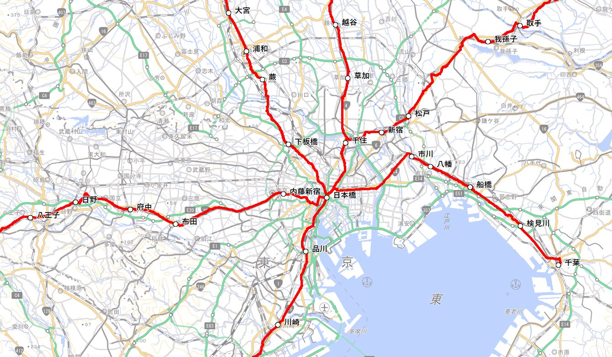
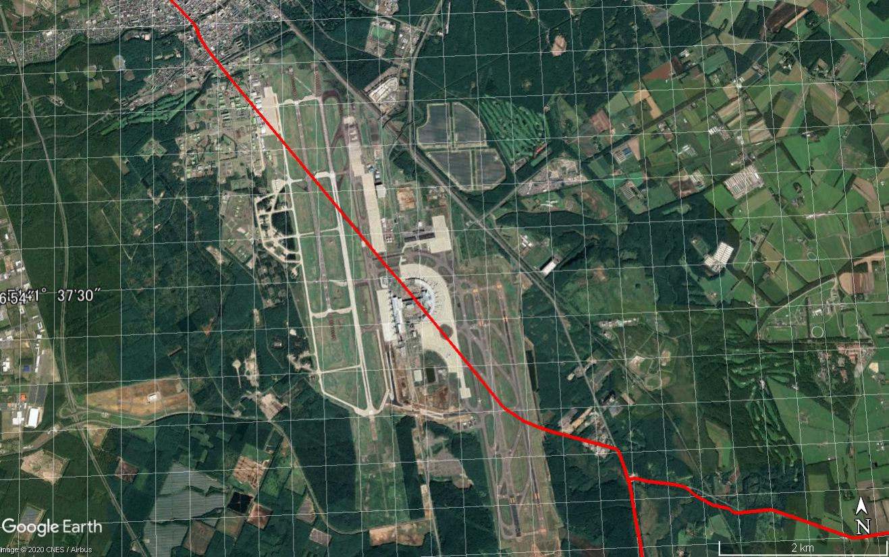
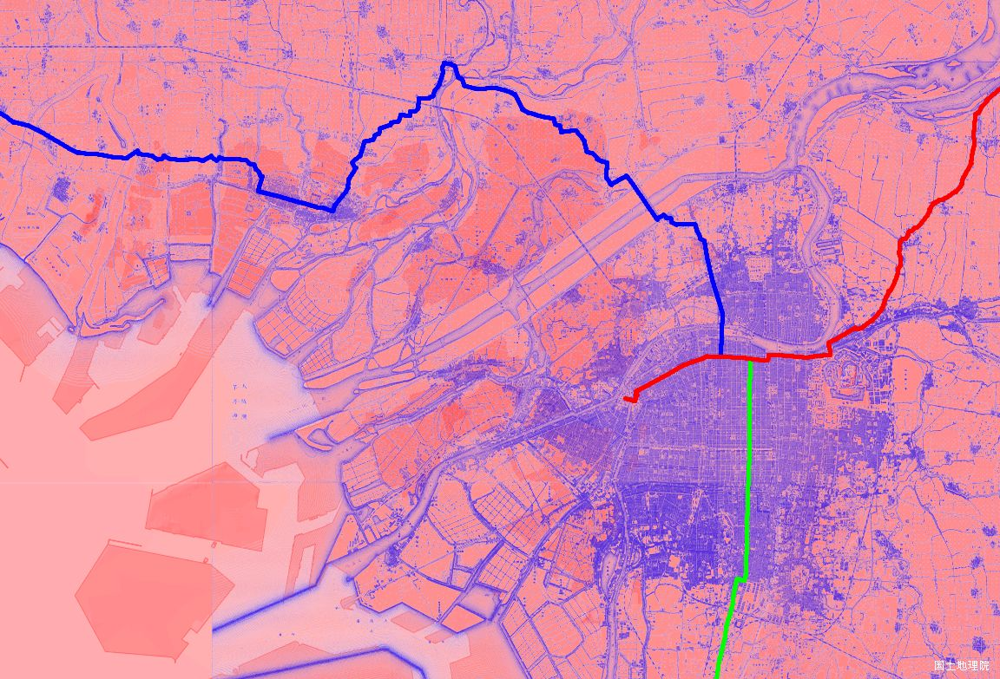

　
# 明治期における国道（明治国道）の比定路線および経過地のKMLデータセット

## 概　 要    
日本で初めてナンバー制による国道体系が示されたのは明治18（1885）年のことです．　

　　**国道表（明治18年2月24日　内務省告示第6号）**　http://japan.road.jp/Law/M18_NaimuK6.htm

公布時には44号までであった路線も改正により追加が行われ，大正4年の最終改正では路線番号は61号までに至りました．（61路線の路線は[Meiji_Route_List.csv](https://github.com/Shigeyuki-Matsunami/Meiji-Route-Map/blob/master/Meiji_Route_List.csv)の通りです．）　本データセットではこの「国道表」における国道61路線がたどったと推定される道筋を主に明治後期から大正初期の旧版地形図からその路線比定を行ったデジタルデータです．

明治国道は一部の路線を除き日本橋を起点として開港場，府県庁，鎮台，鎮守府，師団を結ぶ道を指定していることに特徴があります．国道表では起点と終点および経過地に相当する「地名（駅名）」は記されていますが，どの道が国道であったかを体系的に調査および公表された先行研究はありません．本データセットでは明治期の旧版地形図の図式（明治18年式）で示される「国道」をもとにそのトレースを行い，「路線」および「地名」についてGIS分野で出力のデータ互換性があるKML（Keyhole Markup Language） フォーマットとしたものです．

##  比定方法    
明治期には道路台帳などによる管理文書が存在しないため，明治国道がたどった路線の比定は以下の考えをもとにトレースしています．　　

1. 明治後期から大正初期にかけての５万図[1～4]での図式（明治18年式）の「国道」の二重線を主線とし，国道表の「地名」（経過地）を最短で結ぶ主線を選定した．  
1. 「2万分1正式図」もしくは「2万分1迅速図・仮製図」[5]の該当地域は極力，その地図にある路線を参照した．
1. 当時の測量誤差をみとめ、現在の地理院地形図（2020年9月現在）にある道でそれに相当する区間をトレースした．  
1. 線形改良によって道そのものがなくなってしまっているケースや廃道となっている区間は，国土地理院の1961年もしくは1975年の航空写真で判別できる限りにおいてトレースの参考とした．  
1. 終点は当時の港湾，県庁，鎮台，鎮守府，師団付近の交点とした.  
1. 路線が複数存在する都市部の市街地内の比定は行えていない．かつての街道の情報がある場合にはその情報をもとに路線比定の参照をした．
1. 海上区間については当時の航路の有無を問わず，「地名」間を破線にて記した．

#### 引用・参考サイト  

1. 谷謙二: 時系列地形図閲覧サイト「今昔マップ on the web」  
 http://ktgis.net/kjmapw/index.html  

1. スタンフォード大学: Gaihōzu Japanese Imperial Maps  
  https://stanford.maps.arcgis.com/apps/SimpleViewer/index.html?appid=733446cc5a314ddf85c59ecc10321b41

1. 宮崎県情報政策課：「ひなたGIS」＞　日本版MapWarper 5万分の1  
  https://hgis.pref.miyazaki.lg.jp/hinata/
  
1. 「九州Q地図」＞　陸地測量部・国土地理院等作成図  
  https://info.qchizu.xyz/

1. 国土地理院：　「地図・空中写真・地理調査」＞　図版履歴（旧版地図）  
  https://www.gsi.go.jp/tizu-kutyu.html
 
## データセット概要     
+ **データ形式**：　KML（Keyhole Markup Language）  
+ **測地系**：　世界測地系  
+ **データ構成**：　フォルダは「路線」と「地名」に分けて以下のデータが格納されております．
  + 「路線」：　61路線の起点・終点間のトラックポイント（緯度，経度，標高）をつないだ点群
  + 「地名」：　国道表にある地名について，地形図に記されている地名付近をウェイポイントで参照
  
  なお，ファイル名には「_rev改正年」とあるのは，改正によって路線変更があった場合は変更区間のみを，また地名の変更（追加・修正）の箇所を全てを反映させております．  
  改正履歴についてはこちらを参照してください．
  
  **道路法令集 　（明治18年～明治45年）**　　
  http://japan.road.jp/Law/LawList_Meiji2.htm
  
## 利用方法

1. ダウンロードは画面右上の「code」のボタンを押すとzip形式で本リポジトリ内のドキュメントが全てダウンロードされます．
1. zipを解凍すると「data」フォルダ内のKMLファイルを取得できます．
1. KML対応のGISソフト（Google Earth, カシミール3Dなど）にドラッグ＆ドロップすると自動的に表示がなされます．     
1. 過去の地形図（日本測地系）との対比の場合には，以下の理由によるズレが生じるため補正などを必要とする場合があります．

  * 日本測地系と世界測地系とのズレ
  * 当時の測量水準による誤差
  * クロッピングによる誤差

## 表示例
  【表示例-1】 日本橋を中心にカシミール３Dで地理院タイル（新板-淡色）に路線と地名を表示した場合
     
     
  【表示例-2】 千歳空港を中心にGoogle Earthにて路線を表示した場合   
   

  【表示例-3】 大阪市を中心に今昔マップ「京阪神圏」（1892-1910）の旧版地形図と色別標高図のオーバーレイに路線を表示した場合
     
     
## ライセンス（著作権について）
* このデータセットはクリエイティブ・コモンズの[**CC BY-NC-SA 4.0**（表示 - 非営利 - 継承 4.0 国際）](https://creativecommons.org/licenses/by-nc-sa/4.0/deed.ja)の下に提供されています．

　　　　　

* CC BY-NC-SA 4.0条件であれば連絡は不要ですが，商用・営利目的で利用されたい場合には連絡をお願いいたします．  

## コンタクト先
比定の誤りが認められる場合，商用・営利目的での利用は「コンタクト先」でご連絡をいただければ幸いです．  
japan.road.jp@gmail.com （国道愛好家　松波宛）
  
## 履歴  
2020.09.28　公開  
2020.11.01　国道60号終点修正  

