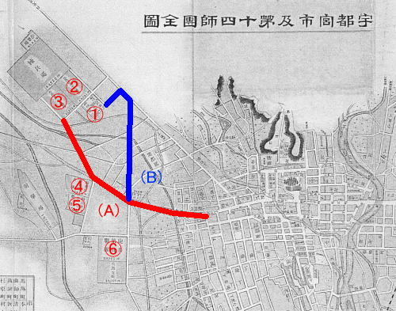

　
# 明治国道60号 東京ヨリ第十四師團ニ達スル路線  
  
指 定：明治44(1911)年03月04日  
起 点：東京（日本橋）  
重 複：明治国道6号  
分 岐：宇都宮  
終 点：第14師団  

地 図：https://www.google.com/maps/d/u/0/edit?mid=1eaQVDW1SEva5vF4_zVLU2KqbyArEfcSi&usp=sharing

## 概　 要    
国道60号は明治国道の晩期の明治44年に制定されたもので，栃木県宇都宮に設営された第14師団までの国道となる．宇都宮までは当時の明治国道6号と重複し，宇都宮から第14師団が位置した国本村までが国道60号の単独区間となる．

第14師団についての経緯は，日露戦争中の明治38年に新師団の増設で誕生したもので，発足当時は小倉に編成された．日露戦争後には小倉から旅順へと日本国外に配置変換された．ところが，2年後の明治40年，陸軍省より「陸軍常備団警備表」の改正によって第14師団が正式に宇都宮に配置されることが告示された．それによれば第14師団は，その組織下に師団司令部（下記①地点）を筆頭として歩兵第28旅団司令部，歩兵第59連隊（下記②地点），歩兵第66連隊（下記③地点），輜重兵第14大隊（下記④地点），騎兵第18連隊（下記⑤地点），野砲兵第20連隊（下記⑥地点），から構成されるものとなっていた．

『栃木県史』では，この第14師団の宇都宮への移転の経緯については「師団が宇都宮に選ばれたことについては，その間どのような経緯があったかははっきりしていない」（栃木県史通史編6）と，その決定までの第一次史料は見出されていない．

| 明治42年9月3日発行　宇都宮市及第十四師団全図  | 
|----| 
|   |  

現在，旧師団司令部は国立病院機構栃木医療センターへと転用されている．また，歩兵第59連隊（下記②地点）と歩兵第66連隊（下記③地点）の一部は宇都宮中央女子高校となっている．その他，地点④および⑤の地点は現在では作新学院高校があり，⑥の野砲兵第20連隊は宇都宮短大附属高校の場所にあった. 

国道60号としての性格上，これらのなかでは「師団司令部」を連絡する道が国道であったと考えられ，明治42年の地図を俯瞰するならば，候補としては二つ挙げられる. 

Ａルートは市街区域と師団司令部までを，ほぼ直線的につなぐものとなる．また，上記の６つの組織施設に対しても連絡する上では好都合な経路を辿ってもいる．一方のＢルートは，師団司令部と野砲兵第20連隊（地点⑥）とを連絡するために第14師団設置後に新たに造られた道路である．現在，このＢルートは国道119号の一部となっている．

今の段階では，このAルートもしくはBルートのどちらが国道であったのか決定できる資料は見出せていない．

宇都宮は，師団設置によって軍都・宇都宮として終戦まで発展を遂げていくことになる．太平洋戦時下においては中島飛行機株式会社を誘致し，関連軍事工場が多く建設された．そして昭和20（1945）年7月12日に宇都宮空襲の惨事をむかえることになる．アメリカ軍の空襲に際する指令書である「目標情報票」には，中島飛行機（株）を筆頭にして攻撃目標と重要性が記され，その並びには「第14師団司令部」も加わっていた．

## 参考・出典  
1. 栃木県史（通史編6近現代1）　栃木県史編纂委員会，栃木県，1982  
1. うつのみやの空襲 宇都宮市教育委員会，宇都宮市教育委員会，2001  
1. 米軍資料集 （うつのみやの空襲』別冊（２））　宇都宮市教育委員会，宇都宮市教育委員会，2001  　　　　　
1. 写真でつづる宇都宮百年　記念出版編集委員会，宇都宮市制１００周年記念事業実行委員会，1996  

     
## ライセンス（著作権について）
* このデータセットはクリエイティブ・コモンズの[**CC BY-NC-SA 4.0**（表示 - 非営利 - 継承 4.0 国際）](https://creativecommons.org/licenses/by-nc-sa/4.0/deed.ja)の下に提供されています．

　　　　　

* CC BY-NC-SA 4.0条件であれば連絡は不要ですが，商用・営利目的で利用されたい場合には連絡をお願いいたします．  

## コンタクト先
比定の誤りが認められる場合，商用・営利目的での利用は「コンタクト先」でご連絡をいただければ幸いです．  
japan.road.jp@gmail.com （国道愛好家　松波宛）
  
## 履歴  
2007.05.02　[公開](http://www.road.jp/~smatsu/Data/Meiji/MR-60.htm)    
2020.11.01　転載
